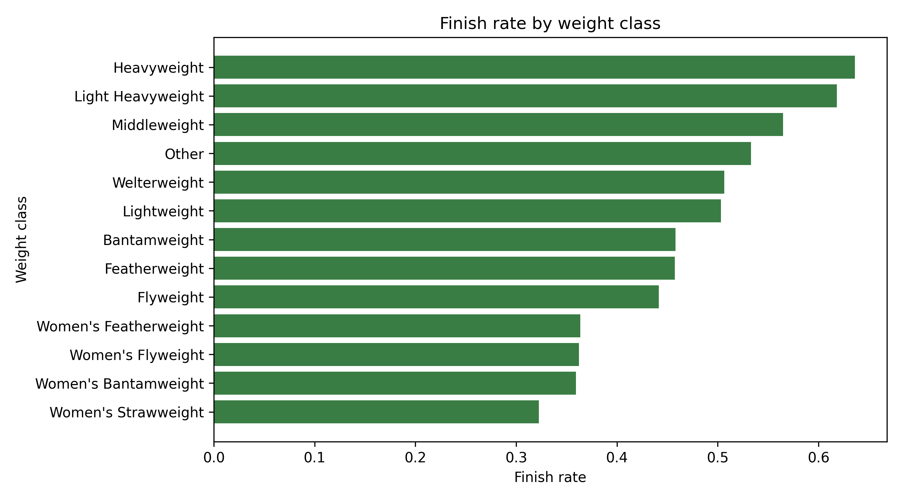
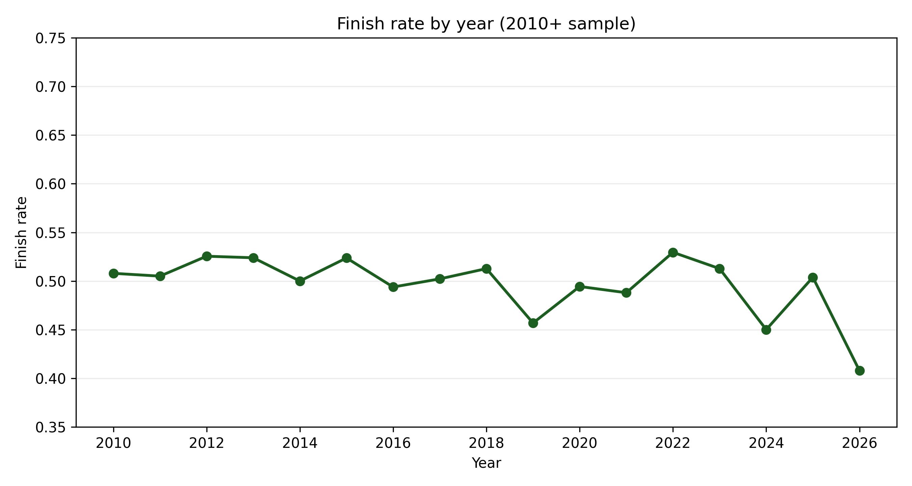
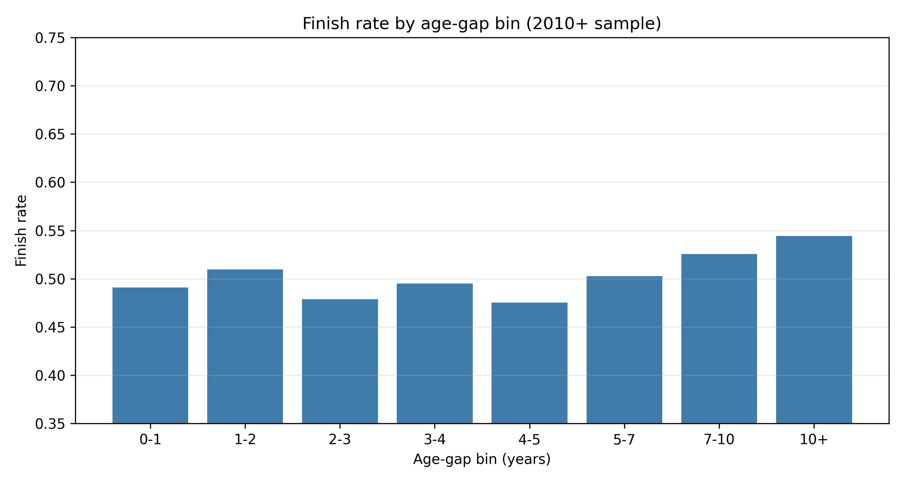
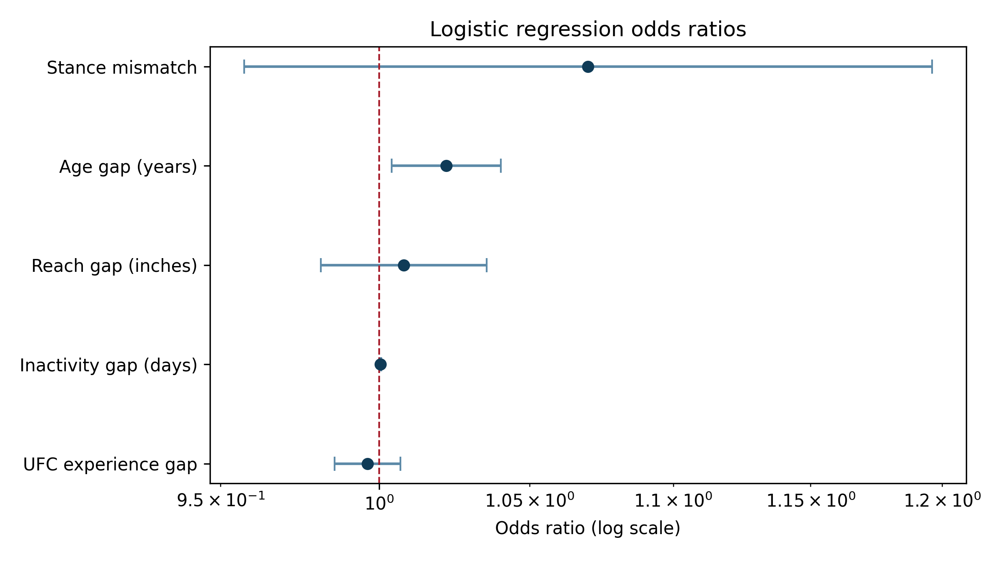

---
title: "What Predicts Whether a UFC Fight Ends in a Finish?"
format:
  html:
    toc: true
    code-fold: false
    page-layout: full
execute:
  echo: false
---

## Introduction

Fans and commentators often treat reach, age, activity, and experience as obvious predictors of whether a fight ends in a finish or a decision. This project tests those claims using a reproducible UFCStats-based dataset.

The main question is simple: **which pre-fight characteristics are associated with a UFC fight ending in a finish rather than a decision?**

Throughout the project, a **finish** is coded as KO/TKO or submission (including doctor stoppages recorded as TKO). Decision outcomes are coded as non-finishes, decision draws are coded with decisions, and No Contest / Overturned / Could Not Continue / DQ outcomes are excluded from the binary outcome.

The analysis compares a focused set of pre-fight factors:

- physical difference, especially reach gap
- age gap between fighters
- difference in prior UFC experience
- difference in inactivity before the bout
- weight class
- stance mismatch

The key empirical question is whether popular fighter-level explanations survive once the model controls for structural differences such as weight class.

## Data

The dataset was built by scraping publicly available UFCStats pages for:

- UFC event pages
- individual fight pages
- fighter profile pages

The full scrape contains:

- **8,560 fights**
- **2,662 fighter profiles**

Because early UFC events include tournament-era structures, different rules, and less consistent weight classes, the main analytical sample is restricted to **2010 onwards**. That leaves:

- **7,295 fights** in the modern sample
- **6,773 fights** in Model 1 and Model 2
- **5,450 fights** in Model 3 after missing-value filtering

The main cleaning steps were:

- coding finish outcomes as KO/TKO-or-submission versus decision, while excluding non-standard outcomes
- standardising weight-class labels
- parsing fighter height, reach, weight, and date of birth into usable numeric values
- merging fighter profiles onto both sides of each fight
- constructing a fight-level analytical dataset with one row per bout

The final project focuses on **pre-fight characteristics**, so the model does not use in-fight statistics such as strikes landed or takedowns completed. That keeps the research question consistent: what can be said about finishes *before* the fight starts?

## Descriptive patterns

Three descriptive patterns are most useful before modelling.

First, finish rates differ sharply across divisions.

{fig-align="center" width="85%"}

Heavyweight and Light Heavyweight bouts are much more likely to end in a finish than lower-weight divisions. Women's divisions, especially Women's Strawweight, have lower finish rates. This already suggests that weight class should be central in the empirical model.

Second, finish rates vary over time but remain broadly around the 50% range across most years.

{fig-align="center" width="85%"}

There is year-to-year movement, but no clear trend break that overturns the cross-division story. The final year in the sample is partial and should be read cautiously.

Third, age-gap bins show a mild upward pattern at larger gaps.

{fig-align="center" width="85%"}

The relationship is not perfectly monotonic at small gaps, but the largest age differences have higher finish rates. This is consistent with the positive age-gap association estimated later in the regression models.

A final descriptive point is sample size. Even after restricting to 2010 onward and applying missing-value filtering in the richest model, the analysis retains over five thousand fights.

## Modelling approach

To study finish probability more formally, the project estimates logistic regression models. Logistic regression is appropriate because the dependent variable is binary:

- `finish = 1` for KO/TKO or submission outcomes (including doctor stoppages)
- `finish = 0` for decision outcomes (including decision draws)

Three model specifications are estimated.

### Model 1: baseline

`finish ~ reach_diff + age_diff + experience_diff`

This asks whether simple differences in fighter attributes are associated with finishes before accounting for division.

### Model 2: add weight class

`finish ~ reach_diff + age_diff + experience_diff + C(weight_class_grouped)`

This is the main specification. It adds weight-class controls, which the descriptive chart suggests are likely to matter a great deal.

### Model 3: richer extension

`finish ~ reach_diff + age_diff + experience_diff + C(weight_class_grouped) + inactivity_diff + stance_mismatch`

This extends the model by adding inactivity difference and stance mismatch. It is informative, but it also uses a smaller estimation sample because those extra variables are missing more often.

Model sample sizes in the 2010+ analysis are:

- **Model 1:** 6,773 fights
- **Model 2:** 6,773 fights
- **Model 3:** 5,450 fights

For interpretation, the most useful way to think about the coefficients is in terms of **odds ratios**. Values above 1 indicate higher odds of a finish, while values below 1 indicate lower odds.

## Results

The main empirical result is that **weight class matters far more than reach difference**.

In the simplest model, reach and age have some association with finishes. Once weight class is added, the reach effect weakens and is no longer statistically convincing. The common claim that reach gap is a major standalone predictor receives little support after fair cross-division comparison.

By contrast, weight class shows a clear and persistent relationship with finish probability. Heavyweight and Light Heavyweight bouts have substantially higher finish odds than the omitted reference class (**Bantamweight**), while most women's divisions have lower finish odds in the pooled models.

Model 3 also suggests that:

- **age gap** is positively associated with finish probability
- **inactivity gap** is positively associated with finish probability
- **experience gap** is not doing much once other controls are included
- **stance mismatch** shows weak evidence at best

The figure below summarises odds ratios from the richer specification.

{fig-align="center" width="80%"}

Two points stand out. First, **age gap** remains above 1 with a relatively tight interval. Second, **reach gap** stays close to 1, reinforcing the conclusion that it is not a strong predictor once broader context is controlled.

For inactivity, the coefficient is a **per-day** effect, so the daily odds-ratio shift is small by construction; the practical effect is clearer over larger inactivity differences.

That makes **Model 2** the headline specification: it retains a larger sample while including the key structural control, weight class. **Model 3** is a richer extension that trades sample size for extra controls.

## Robustness checks

The full specification was re-estimated on two restricted samples:

- a **men-only** sample
- a **non-5-round** sample

The broad patterns remain similar. Heavier divisions still show higher finish odds, and the positive inactivity-gap association remains in the richer specification. This supports the view that the main result is not driven only by women's divisions or by five-round fight structure.

Overall model fit remains modest. The pseudo-R-squared values are low, so the project is best interpreted as identifying broad **associations**, not high-accuracy prediction.

## Limitations

There are several important limitations.

First, the project uses only pre-fight observable characteristics. It does not include richer measures such as style quality, betting odds, injury status, or detailed recent form.

Second, the analysis relies on scraped administrative data. Some variables are missing more often than others, especially in the richer specification, which is why Model 3 uses fewer observations than Model 2.

Third, this is an associational analysis, not a causal one. The results show correlations after controls, not direct causal effects.

Finally, UFCStats access on this machine required HTTP rather than HTTPS. That does not change the underlying data used in the project, but it is a practical technical limitation that should be documented for replication.

## Conclusion

The main answer is that **weight class is the clearest predictor of whether a UFC fight ends in a finish rather than a decision**. Heavyweight and Light Heavyweight bouts finish much more often than lighter divisions, while most women's divisions finish less often in the pooled sample.

By contrast, the widely discussed idea that reach gap strongly predicts finishes receives little support once fights are compared within a model that controls for division. Age gap and inactivity gap appear more informative than reach, but even then the overall model fit remains modest.

So the clearest conclusion is not that one fighter-level attribute explains finishes on its own. It is that the broader competitive environment of the fight, especially the division in which it takes place, matters most.
